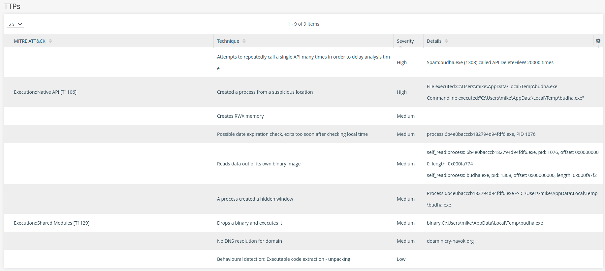

# Intezer Anomali Integration
The [Intezer Analyze](https://analyze.intezer.com) integration with Anomali provides enrichment data for hash observables.

## How does it work?
The integration will take the hash and query it in Intezer Analyze for the latest analysis. 
If an analysis is not found, the integration will try and analyze the hash in case the file is available in Intezer Analyze.

## Setup
To activate the Intezer Analyze enrichment:
1. Log in to the ThreatStream user interface.
2. Navigate to APP Store > APP Store.
3. Search for Intezer Analyze, and click "Get Access".
4. Click "I have already registered" and enter your Intezer API Key found in [account details](https://analyze.intezer.com/account-details).
5. Configure additional parameters:
   * Analysis Timeout in Seconds: Timeout waiting for an analysis to finish in seconds (optional, max is 25), the default is to wait 25 seconds.
   * Private Analysis: Should the querying of the latest analysis only return private analysis, default is false. 
   Use this to avoid consuming quota everytime you query a hash.
6. If errors occur, contact support@intezer.com for assistance.

## Integration Capabilities
The integration will show Intezer verdict and analysis details first:

Fields description:
* **Analysis Id**: A unique identifier assigned to the results of this analysis.
* **Analysis Time**: The date that the analysis was executed.
* **Analysis Url**: A link to a web page in the Intezer Analyze web interface.
* **Family Name**: The name of the family of this file. For example, WannaCry, Lazarus, Magic Hound or zlib.
* **Family Id**: A uuid identifier of the family.
* **Labels**: Labels set to this file, either ones set by Intezer, or ones set by the user.
* **Is Private**: Specifies that the genes of this analyzed file also run against your private Genome Database.
* **Sha256**: The SHA256 Hash of the file.
* **Verdict**: The result of the analysis. For example, Malicious, Trusted, Unknown or Suspicious.
* **Sub Verdict**: Additional details about the verdict.

### Network IOCs 
Network indicators are composed of IPs, domains and URLs collected during the analysis from multiple different sources. These include addresses that were contacted during dynamic execution and addresses that were extracted from an embedded malware configuration.

Notable columns:
* **Source Type**: specifies where each indicator was retrieved from.
* **Classification**: The verdict and, if relevant, the malware family known to be associated with this address.

### Files IOCs 
File indicators are SHA256 hashes of files collected during the analysis from various sources such as static unpacking and collected dropped files. The classification shown is the one that was assigned to each file from genetic analysis.

### TTPs 
Tactics, Techniques, and Procedures (TTPs) allows analysts to understand how the analyzed file operates, and the possible risk posed by it.
The TTPs feature expands the static analysis context by focusing on the actual actions performed during dynamic execution.

Notable columns:
* **MITRE ATT&CT**: [MITRE ATT&CK](https://attack.mitre.org/) Technique Detection name.
* **Technique**: The technique seen in the dynamic execution.
* **Details**: more details on each TTP, including process information, URLs and more. 

## Integration Details 
### Supported entities
* Hash

### Transformations
* EnrichHash
* Activation