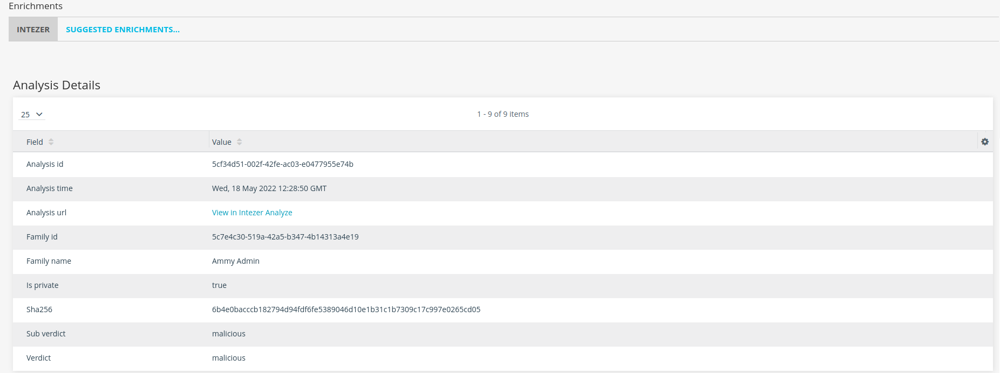
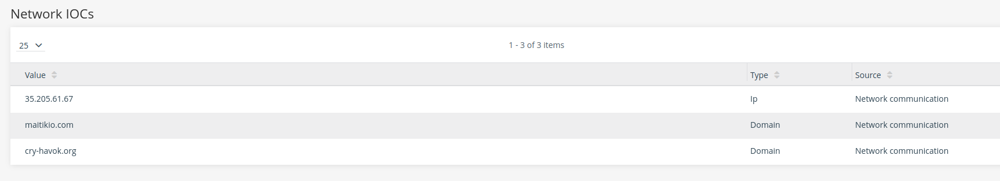
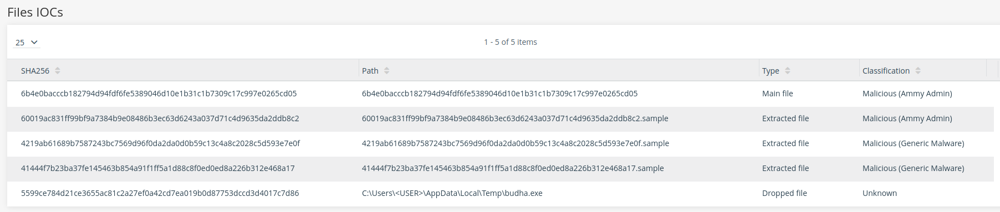
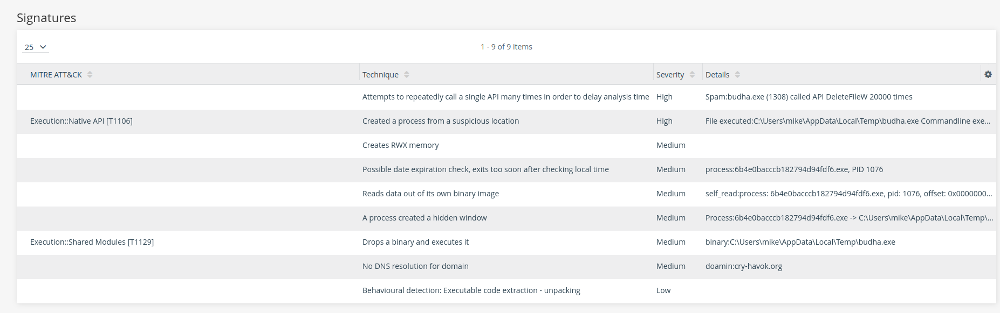

# Intezer Anomali integration
[Intezer Analyze](https://analyze.intezer.com) integration with anomali provide hash enrichment.

## How does it work?
The integration will take the hash and query it in Intezer Analyze for the last analysis. 
If an analysis is not found, the integration will try and analyze the hash in case the file is available in Intezer Analyze.

## Setup
To activate the Intezer Analyze enrichment:
1. Log in to the ThreatStream user interface.
2. In the top navigation bar, click the App Store.
3. Search for Intezer Analyze, and click "Get Access".
4. Click "I have already registered" and enter your Intezer API Key found in [account details](https://analyze.intezer.com/account-details).
5. Configure additional parameters:
   * Timeout waiting for an analysis to finish (optional), the default is to wait until the analysis is finished.
   * Should the querying of the latest analysis only return private analysis, default is false. 
   Use this to avoid consuming quota everytime you query a hash.
6. If errors occur, contact support@intezer.com for assistance.

## Integration Capabilities
The integration will show Intezer verdict and analysis details first:

### Network IOCs 

### Files IOCs 

### Signatures 

## Integration Details 
### Supported entities
* Hash

### Transformations
* EnrichHash
* Activation